# Architecture Documentation

## Overview

`emalify-sms-mno-gateway` is a unified SMS gateway service that routes messages to various Mobile Network Operators (MNOs) in Kenya and internationally. It replaces two legacy services (`ApiGateway` and `sendtomnohandler`) with a single, well-architected service following hexagonal (ports and adapters) architecture.

## High-Level Architecture

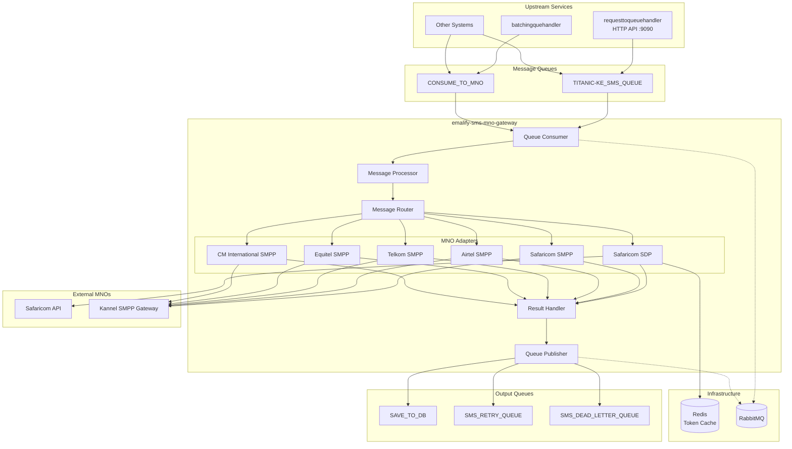

## Hexagonal Architecture

The service follows hexagonal (ports and adapters) architecture to maintain clean separation between business logic and external dependencies.

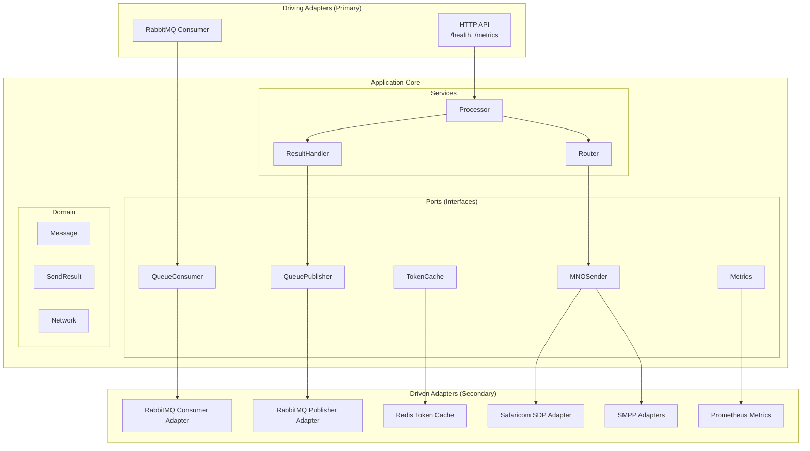

## Directory Structure

```
emalify-sms-mno-gateway/
├── cmd/gateway/
│   └── main.go                 # Application entry point
├── internal/
│   ├── api/
│   │   ├── server.go           # HTTP server setup
│   │   └── handlers/           # HTTP handlers
│   │       ├── health.go       # Health check endpoints
│   │       └── metrics.go      # Prometheus metrics endpoint
│   ├── bootstrap/
│   │   ├── app.go              # Dependency injection & wiring
│   │   └── shutdown.go         # Graceful shutdown handling
│   ├── common/
│   │   ├── circuitbreaker/     # Circuit breaker implementation
│   │   ├── httpclient/         # Pooled HTTP client
│   │   ├── logger/             # Structured logging
│   │   ├── metrics/            # Prometheus metrics
│   │   └── ratelimit/          # Per-network rate limiter
│   ├── config/
│   │   └── config.go           # Configuration loading
│   └── sms/
│       ├── domain/             # Domain entities
│       │   ├── message.go      # Message entity
│       │   ├── result.go       # SendResult & BatchResult
│       │   ├── network.go      # Network enum
│       │   └── errors.go       # Domain errors
│       ├── ports/              # Port interfaces
│       │   ├── mno_sender.go   # MNO sender interface
│       │   ├── queue_*.go      # Queue interfaces
│       │   ├── token_cache.go  # Token cache interface
│       │   └── metrics.go      # Metrics interface
│       ├── service/            # Application services
│       │   ├── processor.go    # Message processor
│       │   ├── router.go       # Message router
│       │   └── result_handler.go
│       ├── adapters/           # Adapter implementations
│       │   ├── mno/            # MNO adapters
│       │   ├── rabbitmq/       # RabbitMQ adapters
│       │   └── redis/          # Redis adapters
│       └── mocks/              # Test mocks
├── docs/                       # Documentation
└── tests/                      # Test files
```

## Message Processing Flow

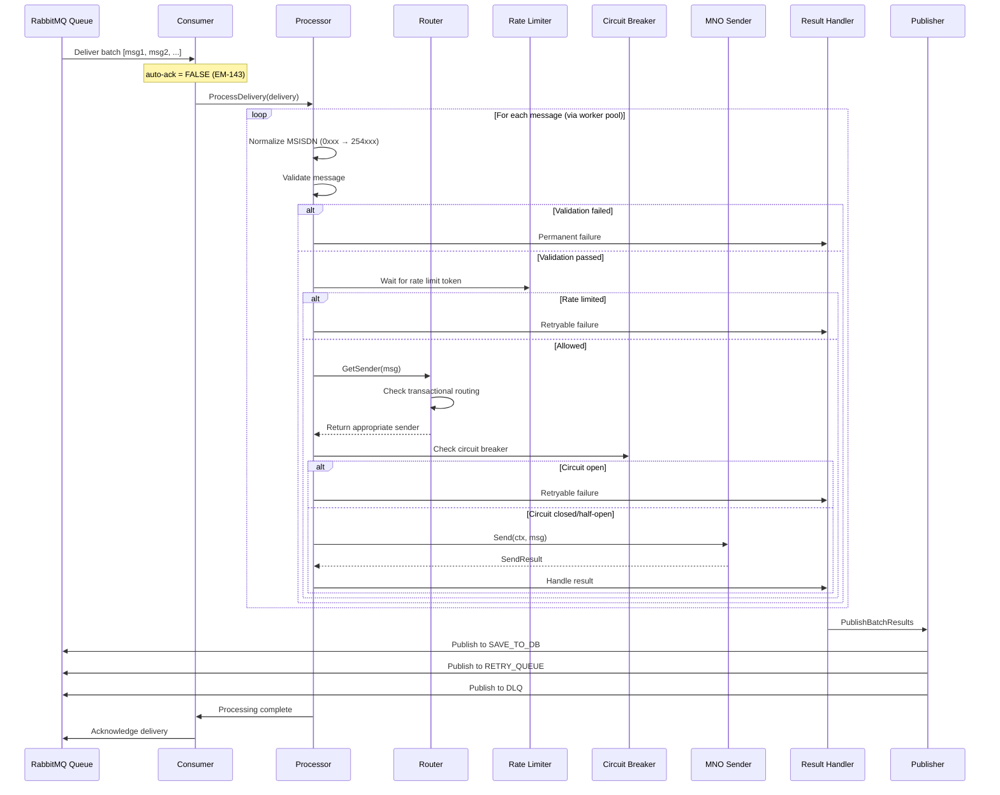

## Transactional Routing Flow

Safaricom messages can be either promotional (via SDP API) or transactional (via SMPP). The `packageId` field determines the routing:

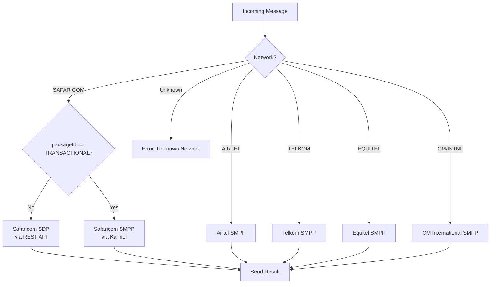

## Result Routing Flow

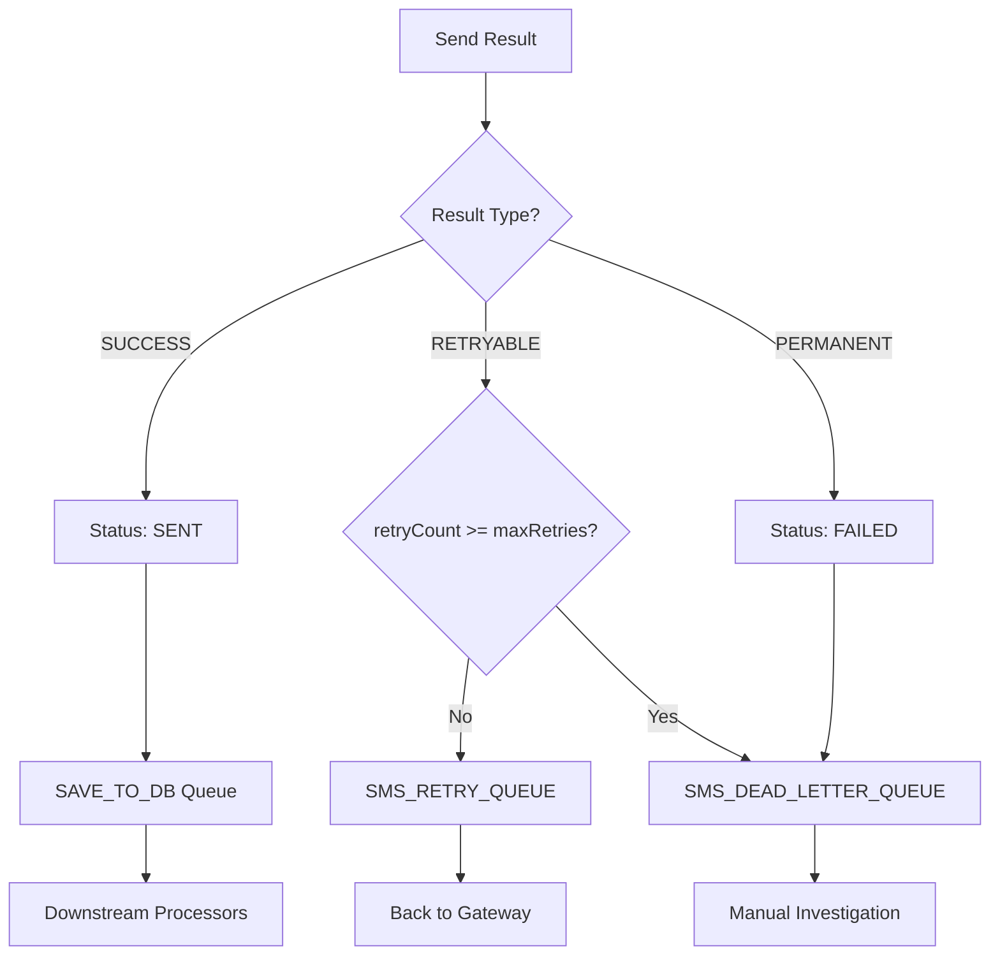

## Circuit Breaker State Machine

Each MNO has its own circuit breaker to prevent cascading failures:

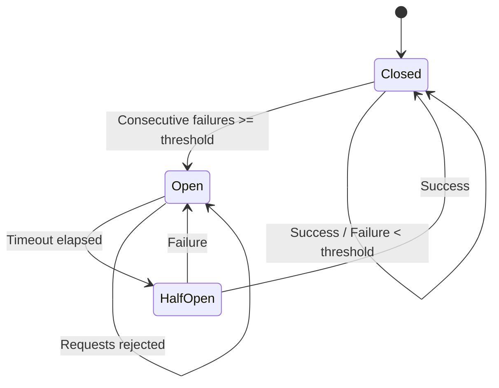

**Configuration:**
- Consecutive failures threshold: 5
- Open state timeout: 30 seconds
- Half-open max requests: 3

## Rate Limiting

Per-network rate limiting protects MNO APIs from being overwhelmed:

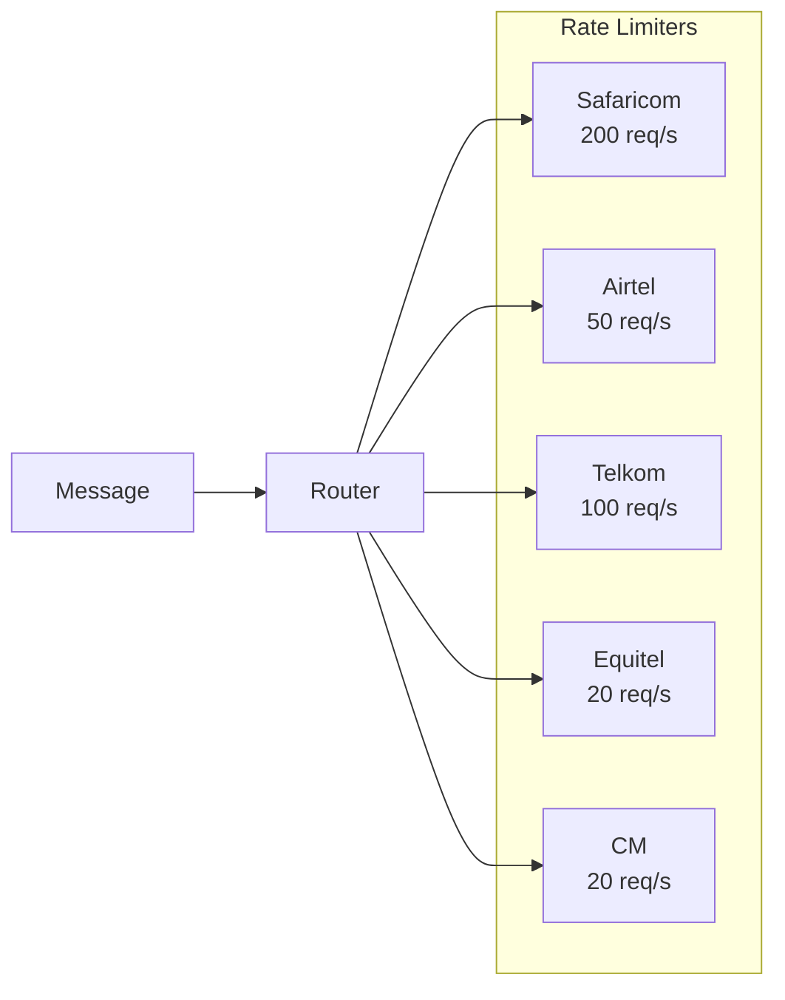

## Token Caching (Safaricom SDP)

The SDP API requires OAuth-style authentication. Tokens are cached in Redis:

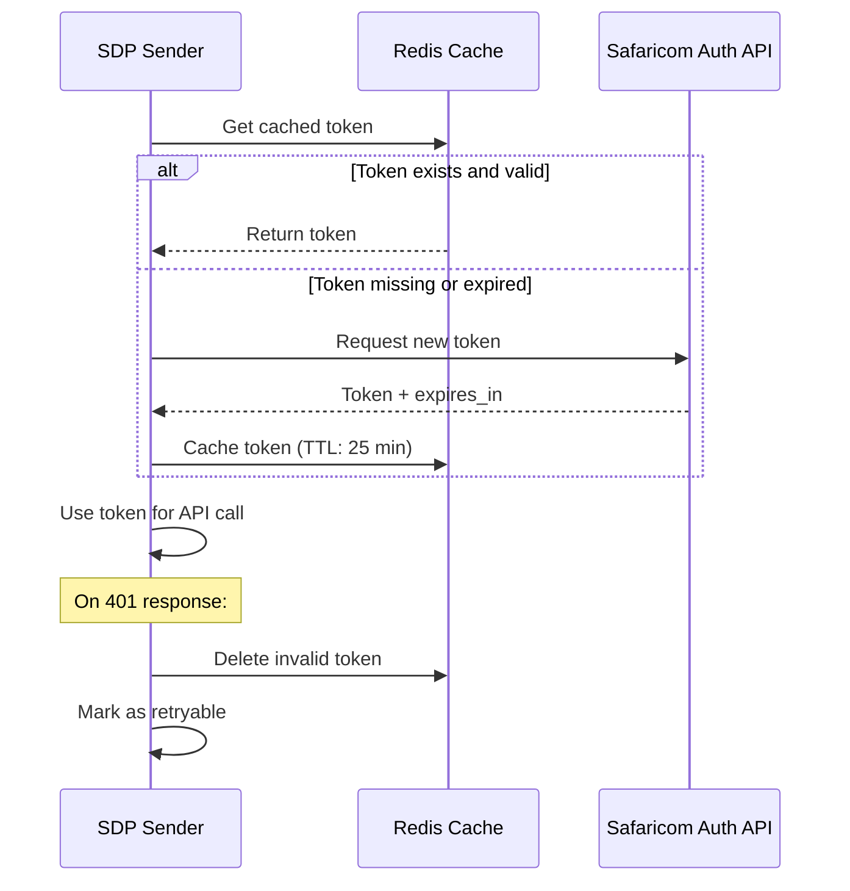

## Worker Pool Architecture

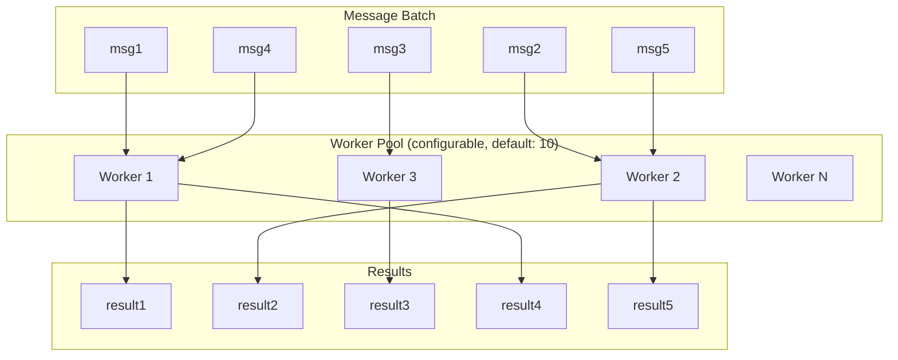

## Graceful Shutdown

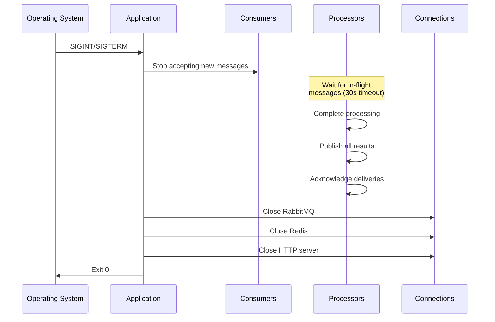

## Component Interactions

### Bootstrap Sequence

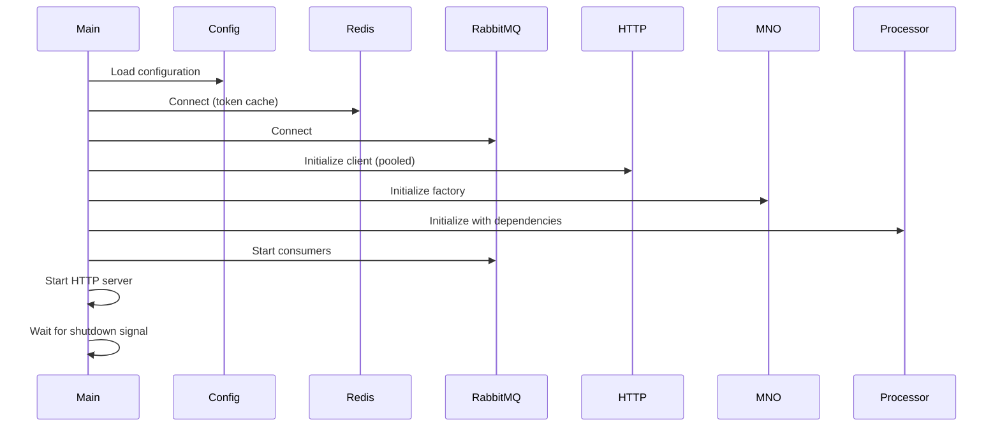

## Error Classification

| Error Type | HTTP Status | Result Type | Queue Destination |
|------------|-------------|-------------|-------------------|
| Network timeout | - | Retryable | RETRY_QUEUE |
| Connection refused | - | Retryable | RETRY_QUEUE |
| Rate limited (429) | 429 | Retryable | RETRY_QUEUE |
| Server error (5xx) | 5xx | Retryable | RETRY_QUEUE |
| Circuit breaker open | - | Retryable | RETRY_QUEUE |
| Bad request (400) | 400 | Permanent | DLQ |
| Unauthorized (401) | 401 | Retryable | RETRY_QUEUE |
| Not found (404) | 404 | Permanent | DLQ |
| Invalid MSISDN | - | Permanent | DLQ |
| Unknown network | - | Permanent | DLQ |
| Max retries exceeded | - | Permanent | DLQ |

## Metrics Exposed

| Metric | Type | Labels | Description |
|--------|------|--------|-------------|
| `sms_messages_processed_total` | Counter | network, status | Total messages processed |
| `sms_send_latency_seconds` | Histogram | network | Send latency distribution |
| `sms_queue_depth` | Gauge | queue | Current queue depth |
| `sms_circuit_breaker_state` | Gauge | network | Circuit breaker state (0=closed, 1=open) |
| `sms_circuit_breaker_trips_total` | Counter | network | Circuit breaker trip count |
| `sms_retries_total` | Counter | network | Total retry count |
| `sms_dead_letters_total` | Counter | network | Total dead letter count |
| `sms_rate_limit_hits_total` | Counter | network | Rate limit hit count |

## Issues Addressed

| Issue ID | Description | Solution |
|----------|-------------|----------|
| EM-143 | Auto-ack losing messages | Manual acknowledgment after processing |
| EM-139 | Response body leak | `defer resp.Body.Close()` in all HTTP calls |
| EM-141 | Connection exhaustion | Shared HTTP client with connection pooling |
| EM-145 | Swallowed Redis errors | Proper error propagation in TokenCache |
| EM-147 | No observability | Prometheus metrics implementation |
| EM-148 | Cascading failures | Per-MNO circuit breakers |
| EM-149 | Permanent failures retried | Proper DLQ routing for permanent failures |
